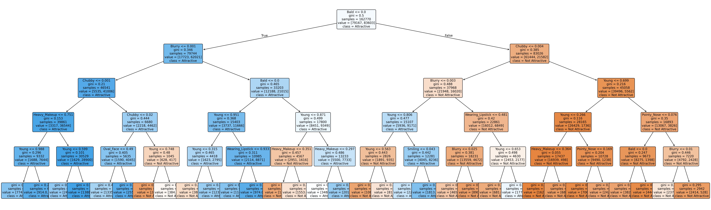

# Concept Bottleneck Model (CBM) on CelebA

This project includes training and evaluation of a Concept Bottleneck Model (CBM) on the [CelebA dataset](https://www.kaggle.com/datasets/kushsheth/face-vae). The dataset contains ~200,000 celebrity images with 40 binary facial attributes per image (e.g., Smiling, Bushy Eyebrows, Wearing Glasses, Wearing Lipstick...). 

The CBM used in this project consists of two main components:
- **Concept Predictor**: a convolutional neural network backbone fine-tuned to predict all concept attributes of the CelebA dataset except the “Attractive” attribute,
- **Decision Tree Classifier**: an interpretable model that uses those concepts to produce the final “Attractive” prediction.

## Model Architecture and Training Parameters

#### Concept Predictor
**Backbone**: ResNet-18 (pretrained on ImageNet)

**Head**: Single fully-connected layer (Linear(512 → 39))

**Loss**: Binary Cross-Entropy across all 39 attributes

**Optimizer**: AdamW

**Learning rates**: 1e-5 (backbone) and 3e-4 (classifier head)
    
**Weight Decay**: 1e-4 (only applied to the classifier head)

**Scheduler**: ReduceLROnPlateau (patience: 3, factor: 0.5)

**Epochs**: 5 (best checkpoint)

**Batch Size**: 16


#### Decision Tree Classifier

**Max depth**: 5 (to keep the model interpretable)

**Criterion**: Gini impurity

## Results

### Concept Model

Prediction of the 39 concepts except the “Attractive” label on the test set:

| Metric        | Score |
| ------------- | ----- |
| **Accuracy**  | 0.92 |
| **Precision** | 0.78 |
| **Recall**    | 0.69 |
| **F1-score**  | 0.72 |

### Concept Bottleneck Model

Predictions of the “Attractive” attribute (i.e. Decision tree trained on the predictions of the Concept Model):

| Metric                       | Score |
| ---------------------------- | ----- |
| **Accuracy**                 | 0.80 |
| **ROC AUC**                  | 0.88 |

**Class-wise Performance**:

| Class              | Precision | Recall | F1-score |
| ------------------ | --------- | ------ | -------- | 
| 0 (Not Attractive) | 0.84      | 0.74   | 0.79     | 
| 1 (Attractive)     | 0.76      | 0.85   | 0.81     | 

### Feature Importance

Feature importances quantify how much each predicted concept contributed to the Decision Tree’s final prediction of the “Attractive” attribute. In this experiment, the most influential concepts were Bald, Blurry, and Chubby, which together account for the majority of the tree’s predictive power.

Below are the normalized importance scores computed by the decision tree:

| Concept          | Importance |
| ---------------- | ----------- |
| Bald             | 0.636 |
| Blurry           | 0.128 |
| Chubby           | 0.127 |
| Young            | 0.062 |
| Heavy_Makeup     | 0.016 |
| Wearing_Lipstick | 0.012 |
| Pointy_Nose      | 0.011 |
| Smiling          | 0.004 |
| Oval_Face        | 0.003 |
| Others           | 0.000 |

Decision Tree Feature Importances


### Ablations

Predictions of the “Attractive” attribute by a decision tree trained only on the top k=3 concepts: **Bald**, **Blurry**, **Chubby**

| Metric                       | Score |
| ---------------------------- | ----- |
| **Accuracy**                 | 0.79 |
| **ROC AUC**                  | 0.87 |

**Class-wise Performance**:

| Class              | Precision | Recall | F1-score |
| ------------------ | --------- | ------ | -------- | 
| 0 (Not Attractive) | 0.82      | 0.75   | 0.78     | 
| 1 (Attractive)     | 0.76      | 0.83   | 0.80     | 


## Project Structure

- `ia176/`
  - `concept_model.py` — LightningModule for the CBM (ResNet18 + linear head)
  - `data/` — DataModule and CelebA dataset
  - `modeling/` — Backbone and head implementations
  - `callbacks/` — Lightning callbacks (prediction saver, evaluator)
  - `decision_tree.py` — Train a Decision Tree on saved concepts
  - `__main__.py` — App entry (Hydra + Lightning Trainer)
- `configs/`
  - `default.yaml` — global config, seeds, logger, and default experiment selection
  - `experiment/` — experiment presets (train, predict, evaluate, saliency, trees)
  - `data/` — dataset and transform configs
  - `model/` — backbone and head configs
  - `logger/` — MLflow logger config
  - `hydra/` — Hydra runtime config
- `analysis/`
  - `saliency_maps.py` — saliency visualizations for selected concepts
  - `feature_importance.py` — visualize and print Decision Tree importances
  - `ablations/train_on_top_k.py` — train a Decision Tree on top-k concepts only
- `preprocessing/` — scripts for data preprocessing (normalization statistics computation)
- `images/` —  generated saliency maps and decision tree plots


### Setup

The project uses a [PyTorch Lightning](https://lightning.ai/docs/pytorch/stable/) and [Hydra](https://hydra.cc/docs/intro/) configuration setup. A standard `pyproject.toml` is used to resolve dependencies. You can run with [uv](https://github.com/astral-sh/uv) in the following way:

```bash
# from repo root
uv sync
```

### Configuration System Overview
The main entry is `configs/default.yaml`, which picks the experiment to run via the `experiment` group. You can specify it in the `default.yaml` configuration file and then just run:
```bash
uv run python -m ia176
```
or specify during runtime:
```bash
uv run python -m ia176 experiment=predict mode="test"
```
Experiments are located in the `configs/experiment/` folder (training, prediction, evaluation, saliency, tree training...)

#### Logging (MLflow)
Logging is configured via `configs/logger/mlflow.yaml`. Uses a local file storage under `./mlruns`.
To launch the MLflow UI run:
```
uv run mlflow ui --backend-store-uri ./mlruns --host 127.0.0.1 --port 5000
```
Then open the UI in your browser at:
```
http://127.0.0.1:5000
```

##  Reproducibility
To reproduce the results, you must first download the CelebA dataset: https://www.kaggle.com/datasets/kushsheth/face-vae. 

Then update dataset locations in `configs/data/datasets/CelebA.yaml` to reflect your local file structure:

- `partition_csv_path`: CSV with train/val/test split (columns: image_id, partition); corresponds to `list_eval_partition.csv`
- `images_dir`: directory with CelebA images; corresponds to `img_align_celeba/img_align_celeba`
- `metadata_path`: CSV with attributes (image_id, 39 attributes + Attractive); corresponds to `list_attr_celeba.csv`

### 1) Training of the Concept Model
Experiment configs: `configs/experiment/train.yaml`, `configs/experiment/predict.yaml`

Uses ResNet-18 + linear head to predict 39 concepts.
```bash
uv run python -m ia176 experiment=train
```
The training and validation metrics are logged to MLflow, along with the best model (with the lowest validation loss) checkpoint.

To evaluate the model on the validation/test sets run:
```bash
uv run python -m ia176 experiment=predict mode="validate"
```
or
```bash
uv run python -m ia176 experiment=predict mode="test"
```

### 2) Save Concept Model's Outputs
Experiment config: `configs/experiment/predict_on_train.yaml`

To save concept predictions for every train image run:
```bash
uv run python -m ia176 experiment=predict_on_train
```
The output path can be configured in the `save_path` entry.

### 3) Train a Decision Tree on the Saved Concepts
Experiment config: `configs/experiment/train_tree.yaml`

To train a decision tree on the saved train concepts and ground-truth `Attractive` labels run:
```bash
uv run python -m ia176.decision_tree
```
The output path can be configured in the `save_path` entry.

### 4) Evaluate the Whole CBM on the Test Set
Experiment config: `configs/experiment/evaluate_cbm.yaml`

To evaluate the CBM run:
```bash
uv run python -m ia176 experiment=evaluate_cbm
```
Notes:

- Requires a CBM checkpoint `checkpoint: ...` (edit the path)
  
- The callback loads `tree_path` (edit accordingly) and prints Accuracy, AUC, Recall, Precision and F1 Score metrics

If you want to evaluate a tree trained on top-k concepts, use:
```bash
uv run python -m ia176 experiment=evaluate_cbm_top_k
```
Experiment config: `configs/experiment/evaluate_cbm_top_k.yaml`

Notes:

- Make sure `tree_path` matches your saved model
  
- Set `top_k_indices` to match the training 


### 5) Saliency Maps 
Experiment config: `configs/experiment/saliency.yaml`

To compute simple pixel-wise gradient saliency map for chosen concept indices and test samples run:
```bash
uv run python -m analysis.saliency_maps
```
Saliency Map for the `Bushy_Eyebrows` concept:


Saliency Map for the `Mouth_Slightly_Open` concept:


### 6) Decision Tree Feature Importances
Experiment config: `configs/experiment/feature_importance.yaml`

Prints feature importances and exports a full tree plot.
```bash
uv run python -m analysis.feature_importance
```
Notes:

- Set `tree_path` and `output_plot_path`
  
- `concepts` list defines feature names in the order that was used during training

### 7) Ablations
Experiment config: `configs/experiment/train_tree_on_top_k.yaml`

To train a Decision Tree using only a subset of concepts from the saved concept predictions run:
```bash
uv run python -m analysis.ablations.train_on_top_k
```
Notes:

- `top_k_indices`: indices of the concepts to keep
  
- `num_concepts`: concept count (39)
  
- `concepts_path` and `save_path`: input and output files (edit accordingly)
